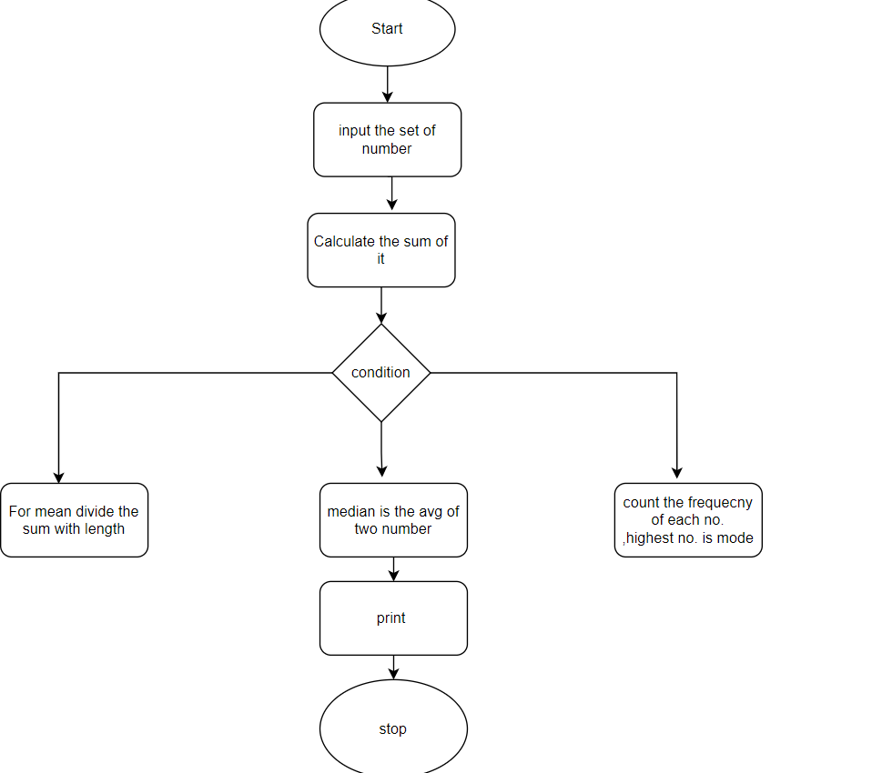

The program should collect an integer array from the user
After the array is entered, you need to create a menu of items
Find the Mean Value
Find the Median Value
Find the Mode Value

Input the set of numbers

Calculate the sum of the numbers

Divide the sum by the total number of numbers to find the mean

Arrange the numbers in ascending order

If the total number of numbers is odd, the median is the middle number. If the total number of numbers is even, the median is the average of the middle two numbers.

Count the frequency of each number

The mode is the number with the highest frequency

Output the mean, median, and mode

Enter the size of the array: 5
Enter the elements of the array:
1
2
3
3
4

Select an option:
1. Mean Value    
2. Median Value
3. Mode Value
4. Exit
1
Mean Value: 2.60

Select an option:
1. Mean Value
2. Median Value
3. Mode Value
4. Exit
2
Median Value: 3.00

Select an option:
1. Mean Value
2. Median Value
3. Mode Value
4. Exit
3
Mode Value: 3

Select an option:
1. Mean Value
2. Median Value
3. Mode Value
4. Exit
4

